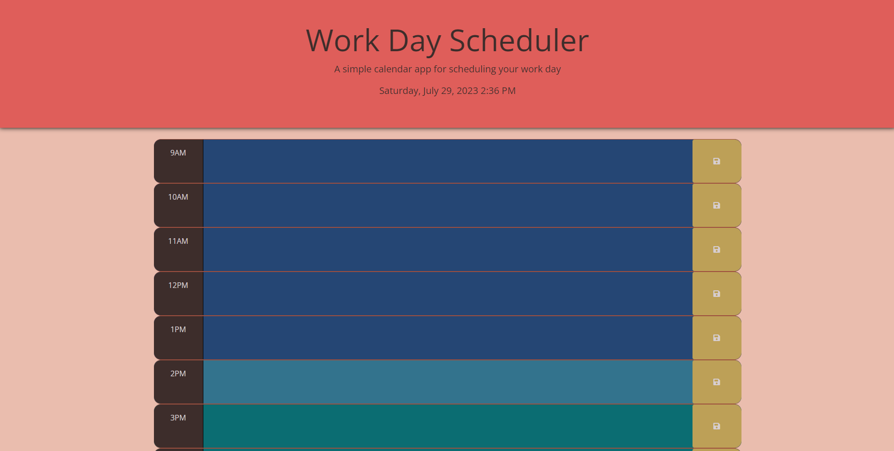

# Work Day Schedule

## Description
This project was provided as a challenge to portray the busy schedule people will have in their work environment, there being many projects or discussions, and it's important not to forget them either. This project was modified from another source.

## Deployed Application
https://ljjordan124.github.io/Work-Day-Schedule/index.html

## Screenshot
The following image shows the web application's appearance and functionality:

## Features
You are introduced to the entire page where you can enter contexts, save those contexts, and you can also clear those contexts. This is meant for any individual that is having a big day for work, or technically for personal projects as well. The webpage introduces itself with it's header as being a Work Day Scheduler, it being a simple calendar app while also presenting the date and the time in a 00:00 sense. Each row has it's own time frame and you will notice there are 3 colors: dark blue is the past time frame, light blue is the current time frame, and dark cyan is the future time frame. In these 3 blue colors you can write context that would fill your own schedule, just make sure you save it by hitting the yellow button for that row and it will mention above that it has been updated. When you're starting the new day, you can Clear the Schedule at the bottom by hitting the button, however, will be presented with a pop-up asking if you are SURE you want to clear your schedule with all context.

## Future Plans
I plan on having the project provide a small ping sound for every hour, helping out people follow their schedules efficiently and knowing when it's a new hour.

## Languages & Dependencies
English

## Built With

* HTML
* CSS
* Javascript
* Bootstrap CDN

## License
[MIT](https://choosealicense.com/licenses/mit/)

## Questions - Contact Me
* Email - jordan3313.lj@gmail.com
* LinkedIn - [Laura Delaney](https://www.linkedin.com/in/laura-jordan-510412241/)
